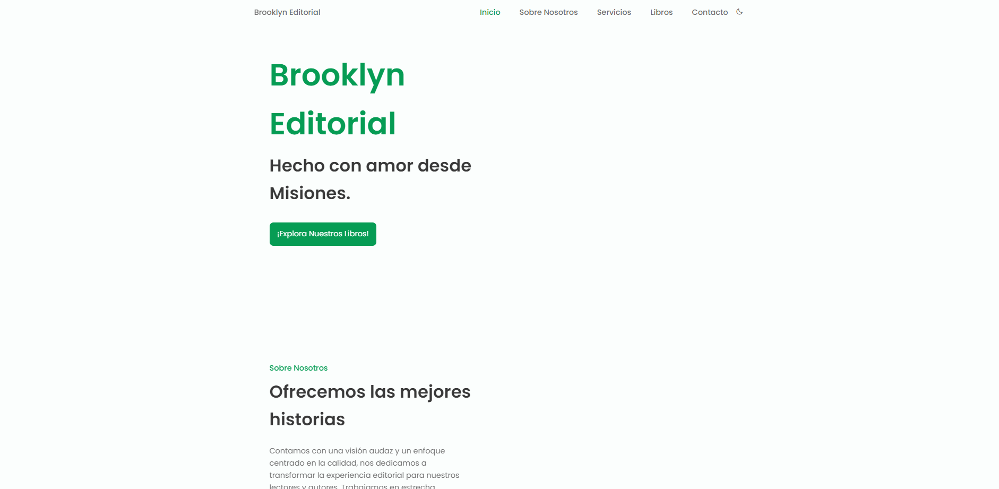
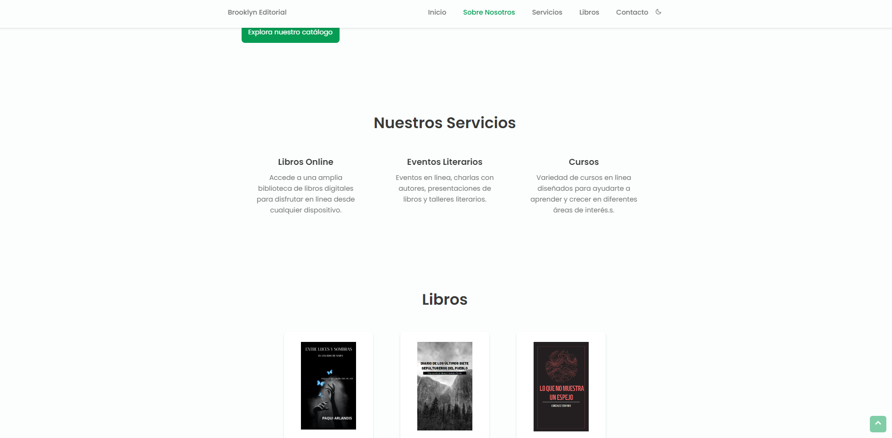
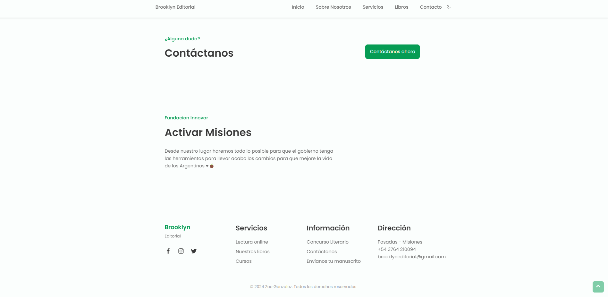

# Brooklyn Editorial

Brooklyn Editorial se dedica a proporcionar una plataforma para autores emergentes y establecidos, ofreciendo una amplia variedad de géneros y estilos literarios. Nuestro compromiso con la excelencia literaria y la diversidad de voces nos impulsa a mantener este sitio web actualizado y accesible para nuestros lectores y autores por igual.

## Características principales

- **Navegación intuitiva:** Diseño de navegación sencillo para una experiencia de usuario fluida.
- **Catálogo de libros:** Descubre nuestra colección de libros, con enlaces directos para acceder a cada obra.
- **Novedades literarias:** Mantente al tanto de nuestras últimas publicaciones y eventos literarios.
- **Concurso literario:** Información sobre nuestro concurso literario anual y cómo participar.
- **Servicios:** Explora los servicios que ofrecemos, incluyendo lectura online y cursos literarios.
- **Información de contacto:** Encuentra nuestras coordenadas para consultas y envíos de manuscritos.

¡Gracias por visitar nuestro repositorio! Tu interés y apoyo son fundamentales para nuestro crecimiento y éxito como editorial independiente.